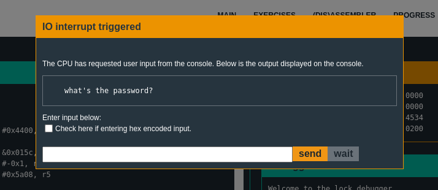

# Microcorruption

## New Orleans : 
Password nya bisa dilihat di func create_password: `5o)Dsnd`

## Sydney :

```as
0x4438 <main>
0x4438:  3150 9cff      add	#0xff9c, sp
0x443c:  3f40 b444      mov	#0x44b4 "Enter the password to continue.", r15
0x4440:  b012 6645      call	#0x4566 <puts>
0x4444:  0f41           mov	sp, r15
0x4446:  b012 8044      call	#0x4480 <get_password>
0x444a:  0f41           mov	sp, r15
0x444c:  b012 8a44      call	#0x448a <check_password>
0x4450:  0f93           tst	r15
0x4452:  0520           jnz	$+0xc <main+0x26>
0x4454:  3f40 d444      mov	#0x44d4 "Invalid password; try again.", r15
0x4458:  b012 6645      call	#0x4566 <puts>
0x445c:  093c           jmp	$+0x14 <main+0x38>
0x445e:  3f40 f144      mov	#0x44f1 "Access Granted!", r15
0x4462:  b012 6645      call	#0x4566 <puts>
0x4466:  3012 7f00      push	#0x7f
0x446a:  b012 0245      call	#0x4502 <INT>
0x446e:  2153           incd	sp
0x4470:  0f43           clr	r15
0x4472:  3150 6400      add	#0x64, sp
```

Ketika program di-mulai, program akan memanggil `<get_password>` untuk menerima input dari user, contoh kita masukkan "password"<br><br>
<br>
Nah, setelah di input nanti password tersimpan di memory address di mulai dari `0x439c - 43a3`, lalu `<check_password>` dipanggil oleh main, di address `0x444c`.<br>
```as
0x448a <check_password>
0x448a:  bf90 6432 0000 cmp	#0x3264, 0x0(r15)
0x4490:  0d20           jnz	$+0x1c <check_password+0x22>
0x4492:  bf90 4e5f 0200 cmp	#0x5f4e, 0x2(r15)
0x4498:  0920           jnz	$+0x14 <check_password+0x22>
0x449a:  bf90 527a 0400 cmp	#0x7a52, 0x4(r15)
0x44a0:  0520           jnz	$+0xc <check_password+0x22>
0x44a2:  1e43           mov	#0x1, r14
0x44a4:  bf90 752a 0600 cmp	#0x2a75, 0x6(r15)
0x44aa:  0124           jz	$+0x4 <check_password+0x24>
0x44ac:  0e43           clr	r14
0x44ae:  0f4e           mov	r14, r15
0x44b0:  3041           ret
```
Pasti kamu sudah bisa menemukan apa yang menarik dalam fungsi ini... Yaaa! `cmp`, karena bisa diliat di func `<check_password>` address 0x448a, meng-<i>compare</i> address lokasi register r15 dengan off-set. Yang pertama pada 0x448a value `#0x3264` di-<i>compare</i> dengan value yang terletak di register `r15: 0x439c` yang memiliki value "p" atau hex 0x70.
<br><br>
Kita langsung aja copy hex yang di <i>compare</i> dengan register r15 dari assembly itu, dengan [little-endianness](https://en.wikipedia.org/wiki/Endianness).<br>
```
448a:  bf90 6432 0000 cmp	#0x3264, 0x0(r15) -> 0x6432
4492:  bf90 4e5f 0200 cmp	#0x5f4e, 0x2(r15) -> 0x4e5f
449a:  bf90 527a 0400 cmp	#0x7a52, 0x4(r15) -> 0x527a
44a4:  bf90 752a 0600 cmp	#0x2a75, 0x6(r15) -> 0x752a
```
Lalu tinggal digabung aja semua jadi: 0x64324e5f527a752a yang diubah ke ASCII menjadi <b>d2N_Rzu*</b>

## Hanoi
Biasanya di-mulai dengan me-ngetes input dengan value "password", jadi langsung aja.
<br><br>

```as
0x4520 <login>
0x4552:  3f40 d344      mov	#0x44d3 "Testing if password is valid.", r15
0x4556:  b012 de45      call	#0x45de <puts>
0x455a:  f290 b800 1024 cmp.b	#0xb8, &0x2410
0x4560:  0720           jnz	$+0x10 <login+0x50>
0x4562:  3f40 f144      mov	#0x44f1 "Access granted.", r15
```
Kita lihat di function `<login>` ada `cmp.b` value `#0xb8` dengan value yang di simpan di address (yang dimulai dari <i>ampersand</i> atau `&`) `0x2410`. Diliat gambar diatas, input password kita disimpan di addres yang di mulai dari 0x2400, dan di address 0x2410 itu harus terisi dengan value `0xb8` agar bisa membuka kunci level ini.<br>
Caranya? simpel, kita hanya perlu mengisi penuh address 0x2400 dengan 16 byte hex 0x41 (yaitu "A") dan satu `0xb8` yang jadi: `41414141414141414141414141414141b8`

## <b>Cusco</b>: <br>
Buffer-overflow attack!<br>
Ini adalah function login, dan juga `<main>` isinya cuma manggil func `<login>` jadi enggak perlu panjang - panjang.

```as
0x4500 <login>
0x4500:  3150 f0ff      add	#0xfff0, sp
0x4504:  3f40 7c44      mov	#0x447c "Enter the password to continue.", r15
0x4508:  b012 a645      call	#0x45a6 <puts>
0x450c:  3f40 9c44      mov	#0x449c "Remember: passwords are between 8 and 16 characters.", r15
0x4510:  b012 a645      call	#0x45a6 <puts>
0x4514:  3e40 3000      mov	#0x30, r14
0x4518:  0f41           mov	sp, r15
0x451a:  b012 9645      call	#0x4596 <getsn>
0x451e:  0f41           mov	sp, r15
0x4520:  b012 5244      call	#0x4452 <test_password_valid>
0x4524:  0f93           tst	r15
0x4526:  0524           jz	$+0xc <login+0x32>
0x4528:  b012 4644      call	#0x4446 <unlock_door>
0x452c:  3f40 d144      mov	#0x44d1 "Access granted.", r15
0x4530:  023c           jmp	$+0x6 <login+0x36>
0x4532:  3f40 e144      mov	#0x44e1 "That password is not correct.", r15
0x4536:  b012 a645      call	#0x45a6 <puts>
0x453a:  3150 1000      add	#0x10, sp
0x453e:  3041           ret
```
```as
0x4452 <test_password_valid>
0x4452:  0412           push	r4
0x4454:  0441           mov	sp, r4
0x4456:  2453           incd	r4
0x4458:  2183           decd	sp
0x445a:  c443 fcff      mov.b	#0x0, -0x4(r4)
0x445e:  3e40 fcff      mov	#0xfffc, r14
0x4462:  0e54           add	r4, r14
0x4464:  0e12           push	r14
0x4466:  0f12           push	r15
0x4468:  3012 7d00      push	#0x7d
0x446c:  b012 4245      call	#0x4542 <INT>
0x4470:  5f44 fcff      mov.b	-0x4(r4), r15
0x4474:  8f11           sxt	r15
0x4476:  3152           add	#0x8, sp
0x4478:  3441           pop	r4
0x447a:  3041           ret
```

Di dalam `0x4526:  0524           jz	$+0xc <login+0x32>`, mengetes register `r15` jika 0, maka akan lompat ke function register 0xc (jz = Jump if Zero). Tapi masalahnya register `r15` akan selalu memiliki value `0` karena pada `0x4470:  5f44 fcff      mov.b	-0x4(r4), r15` di dalam register `r4` offset `0x4`, value tersebut adalah 0. Jadi ketika saya reset debugger dan mulai dengan input 100 "A", dan berberapa menit mencoba debugging lagi. Ternyata buffer-overflow!
<br><br>
Bisa diliat kalo ada 3 function yang ter-overwrite dengan 41 atau "A". Ketika stack-smashing, pointer menunjuk pada value `4141`. Biar tau di address apa pointer berhenti, lalu reset debugger dan kirim password lagi dengan `AAAABBBBCCCCDDDDEEEEFFFFGGGGHHHHIIIIJJJJKKKKLLLLMMMMNNNNOOOOPPPPQQQQRRRRSSSSTTTTUUUUVVVVWWWWXXXXYYYYZZZZ0000111122223333444455556666777788889999` (sebut aja padding).
<br><br>
Dengan itu bisa keliatan kalo program pointer berhenti di address `0x4545` (Atau "EE" karena ter-overwrite). Jadi tinggal ambil padding sampai "F" dan diubah jadi hex, dan ditambah memory address function `<unlock_door>`.<br>
`41414141424242424343434344444444` + `4644` (Bukan `4446` karena diketik dengan little-endiannes)

## Reykjavik

Ngabisin waktu 40 menit buat cari tau ada apa dengan function ini

```as
0x4486 <enc>
0x4486:  0b12           push	r11
0x4488:  0a12           push	r10
0x448a:  0912           push	r9
0x448c:  0812           push	r8
0x448e:  0d43           clr	r13
0x4490:  cd4d 7c24      mov.b	r13, 0x247c(r13)
0x4494:  1d53           inc	r13
0x4496:  3d90 0001      cmp	#0x100, r13
0x449a:  fa23           jnz	$-0xa <enc+0xa>
0x449c:  3c40 7c24      mov	#0x247c, r12
0x44a0:  0d43           clr	r13
0x44a2:  0b4d           mov	r13, r11
0x44a4:  684c           mov.b	@r12, r8
0x44a6:  4a48           mov.b	r8, r10
0x44a8:  0d5a           add	r10, r13
0x44aa:  0a4b           mov	r11, r10
0x44ac:  3af0 0f00      and	#0xf, r10
0x44b0:  5a4a 7244      mov.b	0x4472(r10), r10
0x44b4:  8a11           sxt	r10
0x44b6:  0d5a           add	r10, r13
0x44b8:  3df0 ff00      and	#0xff, r13
0x44bc:  0a4d           mov	r13, r10
0x44be:  3a50 7c24      add	#0x247c, r10
0x44c2:  694a           mov.b	@r10, r9
0x44c4:  ca48 0000      mov.b	r8, 0x0(r10)
0x44c8:  cc49 0000      mov.b	r9, 0x0(r12)
0x44cc:  1b53           inc	r11
0x44ce:  1c53           inc	r12
0x44d0:  3b90 0001      cmp	#0x100, r11
0x44d4:  e723           jnz	$-0x30 <enc+0x1e>
0x44d6:  0b43           clr	r11
0x44d8:  0c4b           mov	r11, r12
0x44da:  183c           jmp	$+0x32 <enc+0x86>
0x44dc:  1c53           inc	r12
0x44de:  3cf0 ff00      and	#0xff, r12
0x44e2:  0a4c           mov	r12, r10
0x44e4:  3a50 7c24      add	#0x247c, r10
0x44e8:  684a           mov.b	@r10, r8
0x44ea:  4b58           add.b	r8, r11
0x44ec:  4b4b           mov.b	r11, r11
0x44ee:  0d4b           mov	r11, r13
0x44f0:  3d50 7c24      add	#0x247c, r13
0x44f4:  694d           mov.b	@r13, r9
0x44f6:  cd48 0000      mov.b	r8, 0x0(r13)
0x44fa:  ca49 0000      mov.b	r9, 0x0(r10)
0x44fe:  695d           add.b	@r13, r9
0x4500:  4d49           mov.b	r9, r13
0x4502:  dfed 7c24 0000 xor.b	0x247c(r13), 0x0(r15)
0x4508:  1f53           inc	r15
0x450a:  3e53           add	#-0x1, r14
0x450c:  0e93           tst	r14
0x450e:  e623           jnz	$-0x32 <enc+0x56>
0x4510:  3841           pop	r8
0x4512:  3941           pop	r9
0x4514:  3a41           pop	r10
0x4516:  3b41           pop	r11
0x4518:  3041           ret
```

Ternyata function diatas cuma menyetor value dari hasil XOR `0x4502:  dfed 7c24 0000 xor.b	0x247c(r13), 0x0(r15)`, dan disimpan di memory address mulai dari 0x2405 - ...<br>

Baru sadar ketika merasa ada yang aneh setelah Disassembler selesai lewat address 0x444e, tetapi program masih berjalan.
```as
0x4438 <main>
0x4446:  b012 8644      call	#0x4486 <enc>
0x444a:  b012 0024      call	#0x2400
0x444e:  0f43           clr	r15
```

Lalu disassembler di reset, dan coba run program lagi tetapi pakai breakpoint di address 0x4510... tapi program pointer berhenti di breakpoint sebelum box yang meminta input password kepada user, lalu ku continue dengan `c` di Console
<br><br>
Loh, kok baru muncul?<br>
Setelah mencoba mengirim "password", dan send, lalu "n"ext 4 kali.
<br><br>
Ternyata...
<br><br>
Diliat dari program pointer yang menunjuk value address 0x2448, Saya kaget. Karena yang saya kira tadi function `<enc>` yang berfungsi hanya menyimpan value hasil dari XOR. Ternyata function `<enc>` men-decrypt dari value yang menjadikan sebuah function.<br>
Balik lagi ke current instruction<br>
`cmp #0xaf9b, -0x24(r4)`<br>
Instruksi itu banding/compare value hex `0xaf9b` dengan value yang di simpan di memory address register `r4` dengan offset `-0x24`. Tinggal memory address register `r4` dikurangi `0x24` dan dapet value yang di-compare.
<br><br>
`0x43fe - 0x24 = 0x43da`<br>
Oh ternyata stack pointer udah ketemu duluan..
<br><br>
Value di memory address 0x43da adalah `0x70`, dan ini adalah "p" kalau di ubah ke dalam ASCII. Jadi `current instruction` nya membandingkan 2 byte input kita dengan hex value `0xaf9b`
<br>`cmp #0xaf9b, -0x24(r4)`<br>
Jadi tinggal kita reset debugger, dan input password sebagai hex dengan value <b>`9baf`</b> (karena [little-endianness](https://en.wikipedia.org/wiki/Endianness) cuy).
